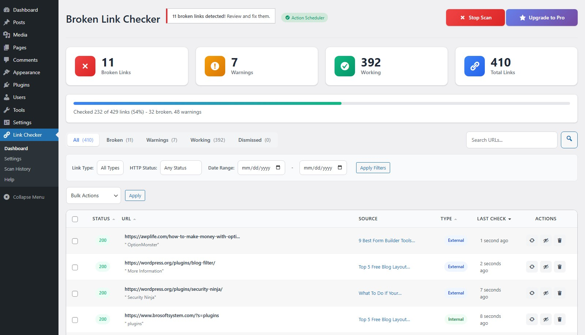
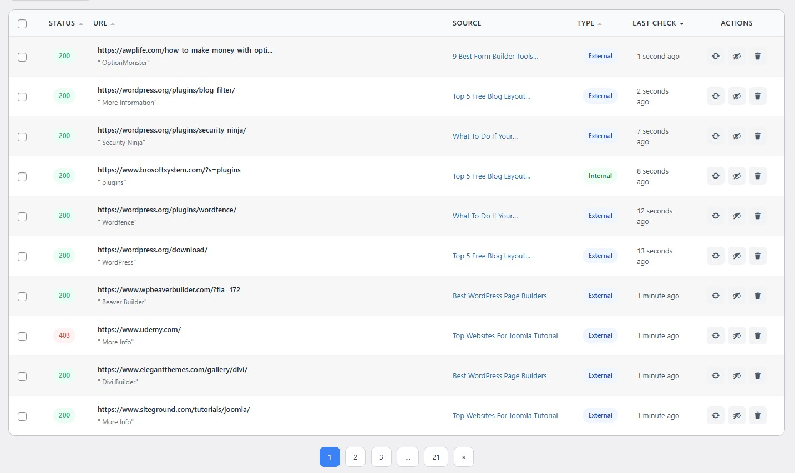
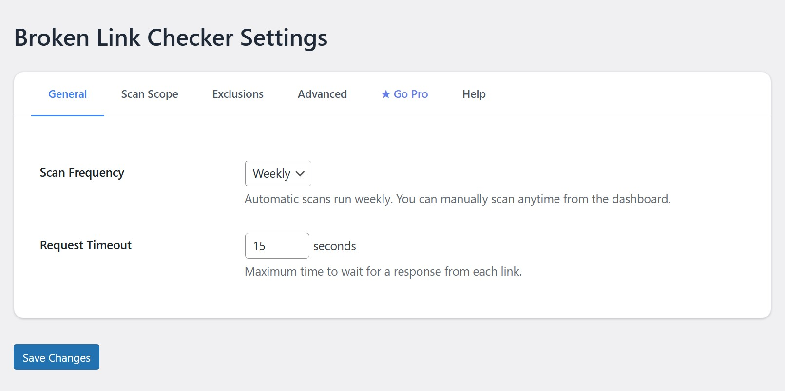

# Frank Dead Link Checker - WordPress Plugin


**Find and fix broken links on your WordPress site. Scan posts, pages, and Gutenberg blocks for 404 errors to improve SEO.**

## 🚀 Description

Dead Link Checker is a powerful WordPress plugin that automatically finds and helps you fix broken links on your website. Broken links hurt your SEO and frustrate visitors – this plugin makes it easy to maintain a healthy, professional website.

### Why You Need This Plugin

- ❌ Broken links negatively impact your Google rankings
- 😤 404 errors create a poor user experience
- ⏰ Manual link checking is time-consuming and error-prone

## ✨ Features

| Feature | Description |
|---------|-------------|
| 🔍 **Scan Posts & Pages** | Automatically scan all your content for broken links |
| 📦 **Gutenberg Support** | Full support for WordPress Block Editor |
| 🔗 **Internal & External Links** | Detect and check both internal and external URLs |
| 📊 **Modern Dashboard** | Beautiful, responsive admin interface with real-time stats |
| ✅ **Dismiss/Undismiss** | Ignore false positives by dismissing links |
| 🔄 **Recheck Links** | Manually recheck any link to verify status |
| 🆕 **Fresh Scan** | Clear all data and start a new scan |
| 📜 **Scan History** | View past scan results (last 5 scans) |
| ⏱️ **Auto-Recheck** | Broken links are automatically rechecked weekly |
| 🚫 **Domain Exclusions** | Exclude up to 3 domains from scanning |

## 📸 Screenshots

### Dashboard

*Dashboard with real-time link statistics and status overview*

### Link Table

*Link table with filtering by status, type, and date*

### Settings

*Settings page with scan configuration options*

## 📥 Installation

### From WordPress Admin

1. Go to **Plugins > Add New**
2. Search for "Dead Link Checker"
3. Click **Install Now** then **Activate**

### Manual Installation

1. Download the plugin zip file
2. Upload to `/wp-content/plugins/` directory
3. Activate through **Plugins** menu in WordPress

## 🎯 How to Use

1. **Start Scan** - Click "Scan Now" to scan your entire website
2. **Review Results** - View broken, warning, and working links in the dashboard
3. **Fix Links** - Go to the source post/page and update broken links
4. **Dismiss False Positives** - Click "Dismiss" for links that work but show errors
5. **Enable Auto-Scan** - Plugin automatically rechecks weekly

## ⚙️ Configuration

### General Settings

| Setting | Description | Default |
|---------|-------------|---------|
| Scan Frequency | How often to auto-scan | Weekly |
| Request Timeout | Wait time for link response | 15 seconds |

### Scan Scope

| Setting | Description |
|---------|-------------|
| Posts | Scan blog posts |
| Pages | Scan pages |
| Internal Links | Check links to your site |
| External Links | Check links to other sites |

### Advanced

| Setting | Description | Default |
|---------|-------------|---------|
| Concurrent Requests | Links checked simultaneously | 2 |
| Excluded Domains | Domains to skip (max 3) | None |
| Verify SSL | Check SSL certificates | Enabled |

## 🔧 Requirements

- WordPress 5.0 or higher
- PHP 7.4 or higher
- MySQL 5.6 or higher

## 📝 Changelog

### 1.0.3 (2026-06-11)
- Security: Handled all unescaped DB parameters to resolve WordPress.org Plugin Check tool warnings.
- Layout: Fixed page-load layout shift and notice flashing on dashboard refresh by introducing server-rendered custom notices container.
- Scanner: Implemented memory-efficient post query chunking (batches of 50) and active cache clearing to prevent memory exhaustion on large sites.
- Mutex: Added transient-based scan initialization mutex to prevent double-scan race conditions.
- Permissions: Added braced capability checks for all AJAX action endpoints and validated post-level edit capabilities on link updates.
- Validation: Enforced strict URL scheme validation (HTTP/HTTPS only) on link updates.
- Uninstall: Cleaned up uninstaller database variables and removed redundant rewrite rules flush.

### 1.0.0 (2024-02-07)
- 🎉 Initial release
- Scan posts and pages for broken links
- Gutenberg block support
- Modern dashboard with statistics
- Filter by status, type, and date
- Bulk actions (recheck, dismiss, delete)
- Scan history (last 5 scans)
- Weekly auto-recheck
- Domain exclusions (up to 3)

## 🤝 Contributing

Contributions are welcome! Please feel free to submit a Pull Request.

1. Fork the repository
2. Create your feature branch (`git checkout -b feature/AmazingFeature`)
3. Commit your changes (`git commit -m 'Add some AmazingFeature'`)
4. Push to the branch (`git push origin feature/AmazingFeature`)
5. Open a Pull Request

## 📄 License

This plugin is licensed under the GPL v2 or later.

```
This program is free software; you can redistribute it and/or modify it
It is under the terms of the GNU General Public License as published by
the Free Software Foundation; either version 2 of the License, or
(at your option) any later version.
```

## 🔒 Privacy

- **No External Connections** – Only connects to URLs on your website during scans
- **No Data Collection** – We do not collect, track, or transmit any personal data
- **Local Storage** – All scan data is stored in your WordPress database
- **GDPR Compliant** – No cookies, no tracking, no third-party services

## 💬 Support

- 📖 [Documentation](https://awplife.com/docs/)
- 💡 [Feature Requests](https://github.com/FARAZFRANK/dead-link-checker/issues)
- 🐛 [Bug Reports](https://github.com/FARAZFRANK/dead-link-checker/issues)
- 📧 [Contact Us](https://awplife.com/contact/)

## 👨‍💻 Authors

- **WP Frank Team** - [wpfrank.com](https://wpfrank.com)
- **AWP Life Team** - [awplife.com](https://awplife.com)

---

⭐ **If you find this plugin helpful, please give it a star on GitHub!**
